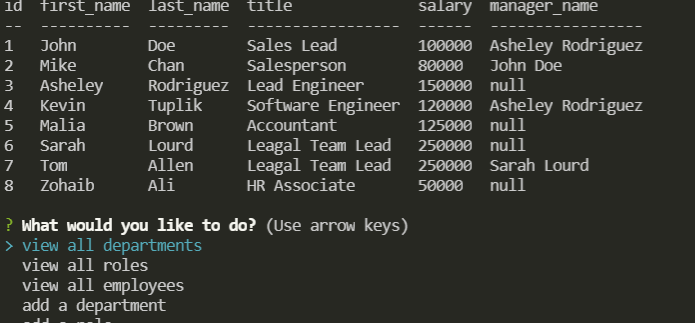

# employeeTracker

## Summary  

The project will show a menu list using inquirer in the command prompt. Depending on the selection it will either display the table or update various tables. 

## Installation

install Node. After install node type the following
npm init
npm install
npm start

## Walkthrough Video
https://drive.google.com/file/d/1ikODhkidsb7o_fQVLAMbykJcXt__mNCN/view?usp=sharing

## Tools used

Node, inquirer,console.table and msql2.

## Contributors

Zohaib Ali
